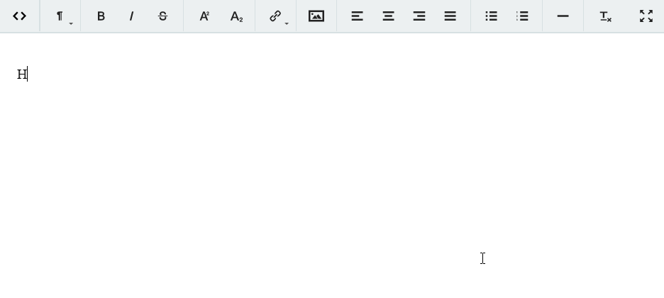

# React-Trumbowyg

React wrapper for [trumbowyg](https://alex-d.github.io/Trumbowyg/ "trumbowyg").

:star2: If you :heart: library, please star it! :star2: 



# Table of contents

- [How do I add this to my project?](#how-do-i-add-this-to-my-project)
- [Dependencies](#dependencies)
- [Starter Guide](#starter-guide)
- [Examples](#examples)
- [Available Properties and Event Handlers](#available-properties-and-event-handlers)
  - [Trumbowyg properties](#trumbowyg-properties)
  - [Self properties](#self-properties)
  - [Event handlers](#event-handlers)
- [Contributors](#contributors)
- [License](#license)

# How do I add this to my project?

Install react-trumbowyg via npm:
```
> npm i react-trumbowyg --save
```

or build from source:

```
> npm install && npm build
```

# Dependencies

React-Trumbowyg depends on Trymbowyg only. 

# Starter Guide

Trumbowyg requires some setup procedures before you can use it. 

1. First of all, you need to install jQuery  

```
> npm i jquery --save
``` 

If you are using webpack or another build system you need to expose jQuery to window as global variable.

__Webpack example:__
  
```
new webpack.ProvidePlugin({
    $: "jquery",
    jQuery: "jquery"
}) 
```

2. Secondly, you need to add Trymbowyg styles
```
import 'react-trumbowyg/dist/trumbowyg.min.css'
```

3. Finally, import React-Trymbowyg component
```
import Trumbowyg from 'react-trumbowyg'

<Trumbowyg id='react-trumbowyg'/>
```

That's it!

# Examples

* [examples-vanilla-js](https://github.com/RD17/react-trumbowyg/tree/master/examples-vanilla-js) - vanilla js example
* [examples-es6](https://github.com/RD17/react-trumbowyg/tree/master/examples-es6) - example with Babel and Webpack

# Available Properties and Event Handlers

React-Trumbowyg expose all properties of Trumbowyg, and adds self as well

## Trumbowyg properties

|                                           Trumbowyg Prop                                                                |    Default    |        Type         |
|:------------------------------------------------------------------------------------------------------------------------|:--------------|:--------------------|
| [id](#id)                                                                                                               |               | ```String```        |
| [data](#data)                                                                                                           |               | ```String```        |
| [placeholder](#placeholder)                                                                                             |               | ```String```        |
| [buttons](https://alex-d.github.io/Trumbowyg/documentation.html#button-pane "buttons")                                  |               | ```Array<String>``` |
| [semantic](https://alex-d.github.io/Trumbowyg/documentation.html#semantic "semantic")                                   | ```true```    | ```Bool```          |
| [resetCss](https://alex-d.github.io/Trumbowyg/documentation.html#reset-css "resetCss")                                  | ```false```   | ```Bool```          |
| [removeformatPasted](https://alex-d.github.io/Trumbowyg/documentation.html#remove-format-pasted "removeformatPasted")   | ```false```   | ```Bool```          |
| [autogrow](https://alex-d.github.io/Trumbowyg/documentation.html#auto-adjust-height "autogrow")                         | ```false```   | ```Bool```          |
| [disabled](https://alex-d.github.io/Trumbowyg/documentation.html#enable-disable-edition "disabled")                     | ```false```   | ```Bool```          |

## Self properties

 * shouldUseSvgIcons:**boolean** - if true, displays SVG icons, else show only text. (Default: true)
 * svgIconsPath:**string** - path to SVG icons file. SVG file will be loaded with AJAX request. (Default: '') 
 * shouldInjectSvgIcons: **boolean** - React-Trumbowyg can inject SVG icons to body, so you can avoid loading it. If this prop is false, you should specify the path to your own svg icons in ```svgIconsPath``` prop. (Default: true)

## Event handlers
 * onFocus - Event handler when the focus is on editor
 * onBlur - Blur on editor 
 * onInit - Editor is initialized
 * onChange - Change in editor
 * onResize - Resize the editor on autogrow
 * onPaste - Paste something in the editor
 * onOpenFullScreen - Switch to fullscreen mode
 * onCloseFullScreen - Leave editor's fullscreen mode
 * onClose - Close the editor

# Contributors
* [Ilya P](http://sochix.ru) - Trumbowyg wrapper component
* [Daniil Nazarov](https://github.com/eezzyybreezzyy) - examples 

## License

The MIT License

Copyright (c) 2016 RD17 http://rdseventeen.com/

Permission is hereby granted, free of charge, to any person obtaining a copy of this software and associated documentation files (the "Software"), to deal in the Software without restriction, including without limitation the rights to use, copy, modify, merge, publish, distribute, sublicense, and/or sell copies of the Software, and to permit persons to whom the Software is furnished to do so, subject to the following conditions:

The above copyright notice and this permission notice shall be included in all copies or substantial portions of the Software.

THE SOFTWARE IS PROVIDED "AS IS", WITHOUT WARRANTY OF ANY KIND, EXPRESS OR IMPLIED, INCLUDING BUT NOT LIMITED TO THE WARRANTIES OF MERCHANTABILITY, FITNESS FOR A PARTICULAR PURPOSE AND NONINFRINGEMENT. IN NO EVENT SHALL THE AUTHORS OR COPYRIGHT HOLDERS BE LIABLE FOR ANY CLAIM, DAMAGES OR OTHER LIABILITY, WHETHER IN AN ACTION OF CONTRACT, TORT OR OTHERWISE, ARISING FROM, OUT OF OR IN CONNECTION WITH THE SOFTWARE OR THE USE OR OTHER DEALINGS IN THE SOFTWARE.